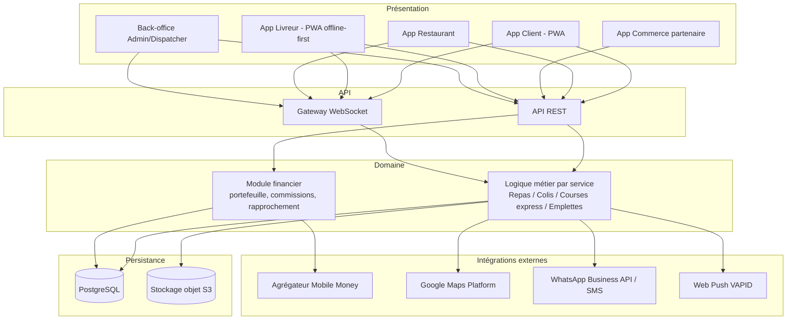

# Architecture

Stack retenue (remplace la section 7 « Flutter » du cahier des charges v2, devenue
caduque — voir [Écarts vs cahier des charges](#écarts-vs-cahier-des-charges) en fin de
document) :

| Couche | Technologie | Rôle |
|---|---|---|
| Front-end | React + TypeScript, Vite | Interfaces des 5 modules |
| PWA | Service worker + manifest | Installabilité, mode hors ligne partiel |
| Données serveur | TanStack Query | Cache, synchronisation, invalidation |
| État client | Zustand **[À ARBITRER]** | État UI local (hors état serveur) |
| UI | Tailwind CSS + shadcn/ui **[À ARBITRER]** | Système de composants |
| Offline (Livreur) | IndexedDB + file de mutations | Continuité d'usage en zone de faible réseau |
| Back-end / API | NestJS, REST | Logique métier, auth, commissions, avances |
| Base de données | PostgreSQL | Stockage structuré (voir [modele-donnees.md](modele-donnees.md)) |
| Temps réel | WebSockets | Suivi live des commandes, alertes |
| Notifications push | Web Push (VAPID) | Alertes navigateur PWA |
| Notifications secours | WhatsApp Business API / SMS | Fallback partenaires/clients peu équipés |
| Paiement | Agrégateur Mobile Money (FedaPay) | MTN MoMo, Moov Money, Celtiis |
| Cartographie | Google Maps Platform | Géocodage, itinéraires multi-arrêts |
| Stockage fichiers | Objet compatible S3 | Photos (plats, produits, tickets, preuves) |

Backend (NestJS) et agrégateur de paiement (FedaPay) décidés le 2026-08-23 — voir
[decisions-ouvertes.md](decisions-ouvertes.md) Q-06 et Q-07.

## Couches applicatives



## Arborescence proposée

**Décidé (2026-08-23)** — Monorepo multi-apps, pour isoler le module Livreur
(offline-first, installable séparément) des autres modules, et partager les types
entre le front-end React/TypeScript et le back-end NestJS/TypeScript. Voir
[decisions-ouvertes.md](decisions-ouvertes.md) Q-19.

```
delivero/
├── apps/
│   ├── client/            # PWA client — repas, colis, courses express, emplettes
│   ├── livreur/            # PWA offline-first — file de mutations, sync différée
│   ├── partenaires/        # Restaurant + Commerce partenaire [À ARBITRER : séparés ?]
│   ├── admin/              # Back-office Admin/Dispatcher (desktop-first)
│   └── api/                # Backend NestJS — API REST + gateway WebSocket
├── packages/
│   ├── ui/                 # Composants partagés (shadcn/ui + thème Tailwind)
│   ├── api-client/         # Client API typé + hooks TanStack Query
│   ├── shared/              # Types, enums (type_service, statuts), schémas de validation
│   └── config/              # Config ESLint/TS/Tailwind partagée
├── docs/
└── CLAUDE.md
```

Découpage par rôle : chaque app expose ses propres routes, protégées par le rôle
authentifié ; `packages/shared` porte les énumérations de statuts par service (voir
[modele-donnees.md](modele-donnees.md)) pour éviter toute divergence entre apps.

## Intégrations externes

| Intégration | Rôle | Données échangées | Points de vigilance |
|---|---|---|---|
| Agrégateur Mobile Money | Initier/confirmer les paiements MTN MoMo, Moov Money, Celtiis | Montant, numéro, référence de transaction, statut | Webhooks à traiter de façon idempotente ; délais de confirmation réseau mobile ; réconciliation avec l'entité Paiement ; gestion des échecs et timeouts |
| Google Maps Platform | Géocodage, carte pour le point de repère, itinéraires multi-arrêts, calcul de distance pour la tarification | Adresses, coordonnées GPS, points d'étape | Adressage approximatif local → le point de repère textuel reste la source de vérité, la carte est un complément ; quota/coût API à surveiller ; chargement lourd en 3G instable |
| WhatsApp Business API | Canal de secours pour partenaires et clients peu équipés, notifications transactionnelles | Statut de commande, OTP, alertes | Coût par message, validation des templates, fiabilité de livraison variable |
| Passerelle SMS | OTP, notifications de secours | Numéro, code, message court | Coût, délais réseau local |
| Web Push (VAPID) | Notifications navigateur pour les PWA installées | Statut de commande | Support limité/partiel sur iOS Safari (voir [pwa-offline.md](pwa-offline.md)) — le fallback WhatsApp/SMS reste obligatoire, pas optionnel |
| Stockage objet S3-compatible | Photos (plats, produits, tickets de caisse, preuves d'enlèvement/livraison, ordonnances) | Fichiers image | Compression obligatoire avant upload (bande passante 3G) ; ordonnances = donnée sensible nécessitant contrôle d'accès strict |
| WebSockets | Suivi temps réel des commandes, alertes restaurant | Événements de changement de statut | Stabilité de connexion en 3G instable → reconnexion avec backoff, fallback polling si la socket est indisponible |

## Écarts vs cahier des charges

La section 7 du cahier des charges v2 (choix Flutter) est intégralement caduque.
Points concrets rendus obsolètes :

- **7.1** — Le choix de Flutter comme framework multiplateforme unique (« un seul
  code, trois plateformes ») est abandonné. Remplacé par une PWA React/TypeScript
  installable, sans compilation native.
- **7.2, ligne Front-end** — « Flutter / Dart » → React + TypeScript.
- **7.2, ligne Temps réel** — « WebSockets / Firebase Cloud Messaging » → WebSockets
  conservé ; Firebase Cloud Messaging remplacé par Web Push (VAPID) + fallback
  WhatsApp/SMS.
- **Note de fin de section 7.2** — « L'application web V1 sera développée en Flutter
  Web » — obsolète.
- **Section 3** — « Le choix de la technologie Flutter permet de développer la V1 web
  et les applications mobiles de la V2 à partir d'une même base de code » — obsolète ;
  la logique de la V2 mobile doit être repensée (voir ci-dessous).
- **Section 8.2, étape 7 (Version 2 mobile)** — « Adaptation Flutter en applications
  Android/iOS, publication sur les stores » n'a plus de sens tel quel. Le besoin d'un
  packaging store natif (ex. via Capacitor) reste **[À ARBITRER]**, voir
  [pwa-offline.md](pwa-offline.md) et [decisions-ouvertes.md](decisions-ouvertes.md).
- **Section 3.1, hors périmètre** — « Applications mobiles natives (objet de la V2) »
  reste vrai comme périmètre non couvert nativement dans l'immédiat, mais pour une
  raison différente : ce n'est plus un séquencement Flutter, c'est un choix
  d'architecture PWA-first dont l'éventuelle suite native reste ouverte.

Tout le reste du cahier des charges (métier, acteurs, spécifications fonctionnelles,
règles de gestion, flux financiers, exigences non fonctionnelles, risques) reste
valable et n'est pas affecté par ce changement de stack.
