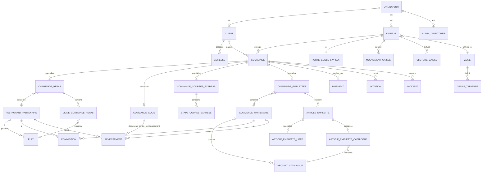

# Modèle de données

**[DÉDUIT]** — Ce modèle n'est pas fourni tel quel dans le cahier des charges ; il est
inféré des spécifications fonctionnelles (section 5) et des flux financiers
(section 5.6). Toute décision de schéma réel (choix de normalisation, moteur,
migrations) revient à l'implémentation, hors périmètre de ce document.

Le **type de service** (Repas / Colis / Courses express / Emplettes) est un concept de
première classe : chaque commande porte un `type_service`, et les entités
spécifiques à un service (ligne de commande repas, étapes de course express,
articles d'emplettes...) sont rattachées à la commande générique.

## Entités principales

### Utilisateur et rôles
- **Utilisateur** — compte de base : téléphone, mot de passe (haché) ou OTP, nom,
  rôle (`client`, `restaurant`, `commerce`, `livreur`, `admin_dispatcher`,
  `direction`), date de création.
- **Permission** / **RolePermission** — **[DÉDUIT, décidé 2026-08-23]** modèle de
  permissions granulaires (liste de permissions associées à un rôle) plutôt qu'un
  rôle monolithique câblé en dur, pour pouvoir scinder `admin_dispatcher` en rôles
  « dispatching » et « administration » plus tard sans refonte. Un seul rôle
  `admin_dispatcher` est effectivement peuplé au lancement. Voir
  [acteurs.md](acteurs.md), [decisions-ouvertes.md](decisions-ouvertes.md) Q-09.
- **Client** — profil client (mode invité possible sans compte persistant).
- **Adresse** — carnet d'adresses du client : libellé, point de repère (texte
  obligatoire), coordonnées carte, adresse par défaut.
- **RestaurantPartenaire** — nom, description, horaires, statut d'ouverture, taux de
  commission, note moyenne. Le champ `taux_commission` n'est plus utilisé pour
  Repas depuis le 2026-08-25 (commission désormais unique et calculée côté
  commande, voir [regles-gestion.md](regles-gestion.md) RG-08) ; il reste
  pertinent pour un partenaire suivant encore le modèle par défaut sur un autre
  service.
- **Plat** — restaurant, nom, catégorie, prix, photo, options/suppléments,
  disponibilité (rupture).
- **CommercePartenaire** — nom, type (supermarché / pharmacie / boutique), horaires,
  statut d'ouverture, taux de commission.
- **ProduitCatalogue** — commerce, nom, catégorie, prix, unité (pièce/kg/paquet),
  disponibilité.
- **Livreur** — utilisateur, zone assignée, pièces d'identité, plafond d'avance,
  plafond de caisse, statut disponible/indisponible, note moyenne.
- **Zone** — périmètre géographique servant de base aux grilles tarifaires (dont la
  grille de frais de livraison Repas par zone, 500 / 1 000 FCFA — voir
  [regles-gestion.md](regles-gestion.md) RG-08) et à l'affectation des livreurs.

### Commande (entité générique) et spécialisations par service
- **Commande** — id, `type_service` (enum), client, statut (valeurs dépendantes du
  service, voir ci-dessous), adresse(s), mode de paiement, montant total, livreur
  attribué, dates de création/mise à jour. Pour Repas, `montant_total` se
  décompose en sous-total plats, frais de livraison et commission (voir
  [regles-gestion.md](regles-gestion.md) RG-08) — **[DÉDUIT]** : à représenter soit
  par des colonnes dédiées sur `Commande`/`CommandeRepas`, soit par des lignes dans
  une entité de décomposition du montant, au choix de l'implémentation.
- **CommandeRepas** — commande, restaurant, lignes de commande.
- **LigneCommandeRepas** — commande repas, plat, quantité, prix unitaire,
  instructions particulières.
- **CommandeColis** — commande, adresse d'enlèvement, coordonnées destinataire,
  taille (petit/moyen/grand), valeur déclarée, option fragile, montant de
  contre-remboursement, code OTP, photo à l'enlèvement, photo/preuve de remise.
- **CommandeCoursesExpress** — commande, description libre, pièces jointes, nombre
  d'arrêts.
- **EtapeCourseExpress** — commande courses express, ordre, description, statut.
- **CommandeEmplettes** — commande, mode (`liste_libre` / `catalogue`), commerce
  (nullable si mode liste libre ou marché non enregistré), budget maximum
  (renseigné uniquement si mode = liste libre — voir
  [service-emplettes.md](service-emplettes.md)), montant réel, mode de financement
  (mobile money anticipé / espèces à la livraison / avance livreur). Le champ `mode`
  détermine la spécialisation applicable à chaque ligne (`ArticleEmpletteLibre` ou
  `ArticleEmpletteCatalogue`, voir ci-dessous) : les deux natures de ligne ne se
  mélangent pas au sein d'une même commande.
- **ArticleEmplette** — entité générique : commande emplettes, quantité, préférence de
  remplacement (équivalent / m'appeler / ne pas acheter), statut (acheté /
  indisponible / remplacé), prix réel, photo. Spécialisée selon le mode de la
  commande (voir [service-emplettes.md](service-emplettes.md)) :
  - **ArticleEmpletteLibre** (mode a) — libellé en texte libre saisi par le client,
    sans référence à un produit catalogué : prix et disponibilité inconnus avant
    l'achat par le livreur.
  - **ArticleEmpletteCatalogue** (mode b) — référence à un `ProduitCatalogue` d'un
    `CommercePartenaire` : prix, unité et disponibilité connus dès la commande.

### Finance
- **Paiement** — commande, montant, mode (mobile money / espèces), statut, référence
  de transaction agrégateur, date.
- **PortefeuilleLivreur** — livreur, solde avancé, solde encaissé, plafond d'avance,
  plafond de caisse.
- **MouvementCaisse** — livreur, commande (nullable), type (avance / encaissement /
  reversement), montant, date.
- **ClotureCaisse** — livreur, date, montant théorique, montant réel, écart.
- **Commission** — partenaire (restaurant ou commerce), type_service, taux. Modèle
  par défaut (retenue sur le partenaire) ; ne s'applique plus au Repas, qui utilise
  un taux unique calculé au niveau de la commande (voir
  [regles-gestion.md](regles-gestion.md) RG-08).
- **Reversement** — bénéficiaire (partenaire ou expéditeur colis), montant, période,
  date, statut.

### Support
- **Notation** — commande, cible (partenaire ou livreur), note, commentaire.
- **Notification** — utilisateur, canal (SMS / WhatsApp / e-mail / push), contenu,
  statut d'envoi, date.
- **Promotion** — code promo, type de réduction, `type_service` (nullable si global),
  dates de validité.
- **Incident** — commande, type (annulation, remboursement, litige, client
  injoignable, colis refusé/endommagé, article contesté), statut, description,
  traité par (admin_dispatcher), date.
- **JournalAction** — acteur, action, cible, date (traçabilité back-office).

## Énumérations de statuts par service

- **Repas** : `en_attente_acceptation`, `confirmee`, `refusee`, `en_preparation`,
  `prete`, `recuperee_par_livreur`, `en_route`, `livree`, `annulee`.
- **Colis** : `confirmee`, `livreur_en_route_enlevement`, `colis_recupere`,
  `en_route`, `livre`, `litige`, `annulee`.
- **Courses express** : `confirmee`, `en_cours`, `etape_realisee`, `terminee`,
  `litige`, `annulee`.
- **Emplettes** : `confirmee`, `achats_en_cours`, `validation_depassement`,
  `achats_termines`, `en_route`, `livree`, `litige`, `annulee`.

Détail des transitions : voir la machine à états de chaque fiche service
([service-repas.md](service-repas.md), [service-colis.md](service-colis.md),
[service-courses-express.md](service-courses-express.md),
[service-emplettes.md](service-emplettes.md)).

## Diagramme entité-relation

## Points ouverts sur le modèle

- **[À ARBITRER]** — Faut-il une entité `CompteEntreprise` distincte pour la
  facturation différée (RG-15), ou un simple attribut sur `Client` ?
- **[À ARBITRER]** — Le `destinataire` d'un colis et le `réceptionnaire` (courses
  express, emplettes) ont-ils une trace en base (nom, téléphone) sans compte
  utilisateur, ou sont-ils de simples champs texte sur la commande ?
- **[DÉDUIT]** — Aucune entité de fidélité (points, parrainage) : hors périmètre
  explicite (voir [perimetre.md](perimetre.md)).
