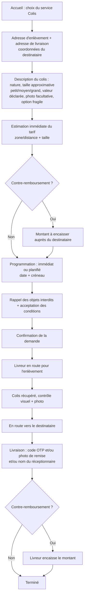
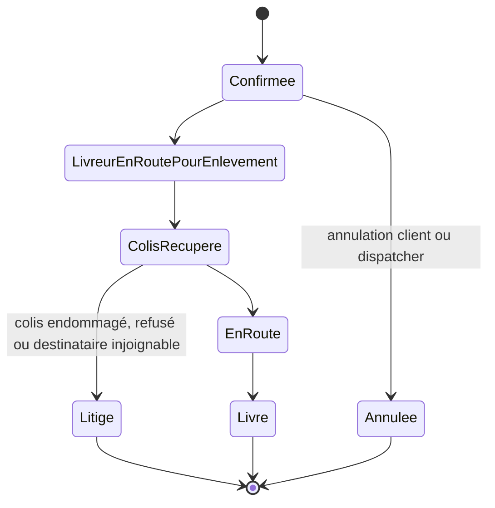

# Service Colis

Enlèvement et livraison de colis, plis et documents d'un point A à un point B, pour
particuliers, entreprises et e-commerçants, avec option de contre-remboursement.

## Parcours client pas à pas

## Machine à états

## Règles métier

- **Objets interdits au transport** : produits inflammables, armes, espèces animales,
  médicaments sur ordonnance sans validation. Rappel obligatoire au client avant
  confirmation, avec case d'acceptation des conditions.
- **Preuve de livraison** : code de confirmation (OTP) communiqué au destinataire,
  et/ou photo de remise, et/ou nom du réceptionnaire.
- **Contre-remboursement** : le livreur encaisse un montant auprès du destinataire à
  la livraison ; ChapExpress consolide les montants collectés et les reverse à
  l'expéditeur selon une périodicité définie (exemple cité : hebdomadaire), avec
  relevé détaillé. Voir [regles-gestion.md](regles-gestion.md) RG-04.
- **Validation des demandes sensibles** : un colis de valeur déclarée élevée
  nécessite une validation manuelle du dispatcher avant attribution. Seuil
  **[À ARBITRER]**.
- **Plafond de responsabilité** : la valeur déclarée sert de base à un plafond de
  responsabilité de ChapExpress en cas de perte/dommage, défini dans les CGU —
  montant et modalités **[À ARBITRER]**, voir
  [decisions-ouvertes.md](decisions-ouvertes.md) Q-05.
- **Programmation** : enlèvement immédiat ou planifié (date et créneau horaire).

## Implémentation backend (2026-08-27)

Voir [api-colis.md](api-colis.md) pour le contrat complet des endpoints.
Décision sur le statut `Litige` (question laissée ouverte par la machine à
états ci-dessus) : atteignable dès cette itération backend, déclaré par le
livreur lui-même (colis endommagé, refusé, destinataire injoignable), sans
validation ni traitement par un dispatcher — aucun back-office n'existe encore
pour ça (RG-12). Le litige reste donc un état terminal de traçabilité pour
l'instant, pas un point d'entrée dans un flux de résolution.

## Cas limites

- **Colis refusé par le destinataire** : traité comme incident par le dispatcher
  (annulation, retour à l'expéditeur, refacturation éventuelle — modalités
  **[À ARBITRER]**).
- **Colis endommagé** (à l'enlèvement ou en cours de route) : la photo prise à
  l'enlèvement sert de référence pour la contestation.
- **Destinataire injoignable ou absent** : appel du livreur intégré au parcours ;
  au-delà, escalade au dispatcher.
- **Colis interdit détecté après création de la demande** : droit de refus du livreur
  et du dispatcher (voir [regles-gestion.md](regles-gestion.md) RG-16).
- **Échec du contre-remboursement** (destinataire ne peut/veut pas payer) : traité
  comme incident, colis non remis ou remis avec créance en attente —
  **[À ARBITRER]**.
- **Contestation de la remise** (destinataire nie avoir reçu le colis) : arbitrée à
  partir de la preuve de livraison (OTP, photo, nom du réceptionnaire).

## Flux financier

1. Frais de livraison (transport) : à la charge de l'expéditeur, payé au moment de la
   commande (Mobile Money) ou en espèces — **[À ARBITRER]** : au moment exact du
   paiement (création vs. enlèvement vs. livraison) n'est pas précisé dans le cahier
   des charges.
2. Si contre-remboursement : le livreur encaisse le montant du produit/service auprès
   du destinataire à la livraison. Ce montant est distinct des frais de livraison.
3. ChapExpress consolide les montants de contre-remboursement collectés par
   l'ensemble des livreurs et les reverse à l'expéditeur selon une périodicité
   définie (exemple : hebdomadaire), avec relevé détaillé.
4. **[À ARBITRER]** : ChapExpress prélève-t-elle une commission sur le montant du
   contre-remboursement en plus des frais de livraison ? Non précisé.
5. Le solde encaissé en espèces par le livreur (frais de livraison + contre-
   remboursement) entre dans son rapprochement de caisse quotidien.

## Ce que voit le livreur

- Détail de la course : adresse d'enlèvement, adresse de livraison, coordonnées du
  destinataire, taille/nature du colis, mention « fragile », montant de
  contre-remboursement à encaisser le cas échéant.
- Contrôle visuel du colis à l'enlèvement avec prise de photo obligatoire.
- Saisie du code de confirmation (OTP) ou photo de remise à la livraison.
- Encaissement du contre-remboursement si applicable, intégré à son portefeuille.
- Itinéraires multi-arrêts (enlèvement puis livraison) ouverts dans Google Maps.
