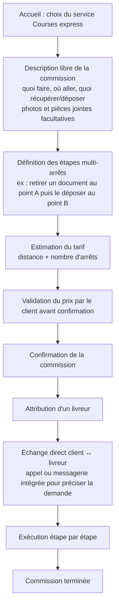
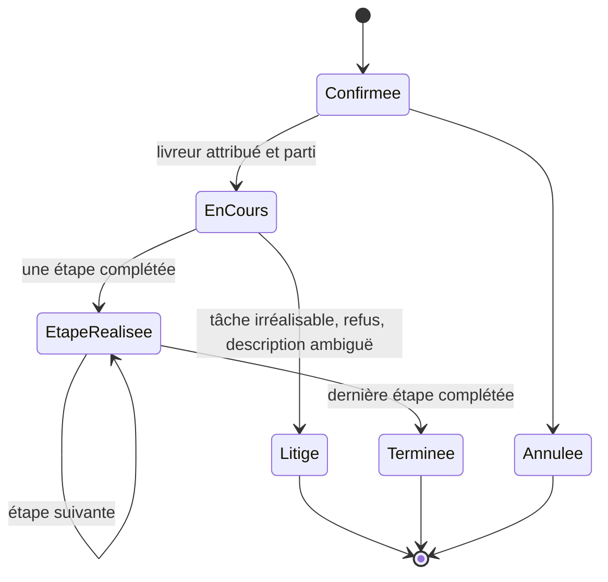

# Service Courses express

Commissions diverses à la demande : dépôt/retrait de documents, achat simple dans une
boutique précise, retrait d'un produit déjà payé, démarche de proximité.

## Parcours client pas à pas

## Machine à états

## Règles métier

- **Description libre obligatoire** de la commission ; photos et pièces jointes
  facultatives pour préciser la tâche.
- **Multi-arrêts** : une commission peut comporter plusieurs étapes (récupération en
  A, dépôt en B, etc.), chacune suivie individuellement.
- **Prix validé avant confirmation** : le tarif est estimé sur la distance et le
  nombre d'arrêts, et doit être accepté par le client avant que la commission ne soit
  confirmée.
- **Canal direct client ↔ livreur** : appel ou messagerie intégrée pour clarifier la
  demande en cours d'exécution.
- **Droit de refus** du livreur (et du dispatcher) sur une commission jugée illicite,
  dangereuse ou hors périmètre (voir [regles-gestion.md](regles-gestion.md) RG-16).
- **Validation manuelle des commissions inhabituelles** par le dispatcher (voir
  [regles-gestion.md](regles-gestion.md) RG-11).

## Implémentation backend (2026-08-27)

Voir [api-courses-express.md](api-courses-express.md) pour le contrat complet
des endpoints. Décisions prises pendant l'implémentation :

- **Statut `litige`** : atteignable uniquement depuis `en_cours`, strictement
  conforme à la machine à états ci-dessus, déclaré par le livreur lui-même
  sans validation dispatcher (aucun back-office) — même principe que Colis et
  Emplettes.
- **Auto-boucle "étape suivante"** : une étape peut être réalisée tant que la
  commande est `en_cours` ou `etape_realisee` (les deux "en cours
  d'exécution"), jamais depuis `confirmee`/`terminee`/`litige`/`annulee`.
  Réaliser une étape déjà réalisée est refusé (409), pas de double comptage.
- **Tarification** : provisoire, tarif de base par zone + majoration fixe par
  arrêt supplémentaire (constante en code) — non un chiffre validé par la
  direction.

## Cas limites

- **Description insuffisante ou ambiguë** : le canal d'échange direct client↔livreur
  sert à clarifier ; en dernier recours, escalade au dispatcher.
- **Étape supplémentaire découverte en cours d'exécution** (ex. il faut faire la
  queue à un guichet non anticipé) : renégociation du prix ou du délai —
  **[À ARBITRER]**, non détaillé dans le cahier des charges.
- **Tâche irréalisable telle que décrite** (boutique fermée, document introuvable) :
  traité comme incident par le dispatcher.
- **Client injoignable pendant l'exécution** : traité comme incident générique (voir
  [regles-gestion.md](regles-gestion.md) RG-12).
- **Achat impliquant une avance de fonds par le livreur** (« achat simple dans une
  boutique précise ») : le cahier des charges ne détaille pas de mécanisme d'avance
  spécifique à ce service, contrairement aux Emplettes. **[DÉDUIT]** : le même
  mécanisme de plafond d'avance du portefeuille livreur s'applique probablement.
  **[À ARBITRER]**.

## Flux financier

1. Le client valide un tarif estimé (distance + nombre d'arrêts) avant confirmation.
2. Paiement selon le socle commun : Mobile Money ou espèces à la livraison/remise
   finale.
3. **[À ARBITRER]** : si la commission implique un achat pour le compte du client
   (montant variable, non connu à l'avance), le mécanisme d'avance et de
   régularisation n'est pas précisé — à définir par analogie avec le service
   Emplettes (voir [service-emplettes.md](service-emplettes.md)) ou à exclure de ce
   cas d'usage.
4. Le montant encaissé en espèces par le livreur entre dans son rapprochement de
   caisse quotidien.

## Ce que voit le livreur

- Description libre de la tâche, avec photos/pièces jointes fournies par le client.
- Liste des étapes (multi-arrêts) à réaliser dans l'ordre, avec adresses.
- Montant à percevoir (le cas échéant) et tarif de la course.
- Bouton d'appel/messagerie direct vers le client.
- Mise à jour du statut étape par étape jusqu'à la finalisation.
- Itinéraires multi-arrêts ouverts dans Google Maps.
