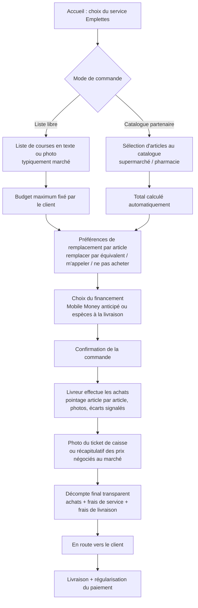
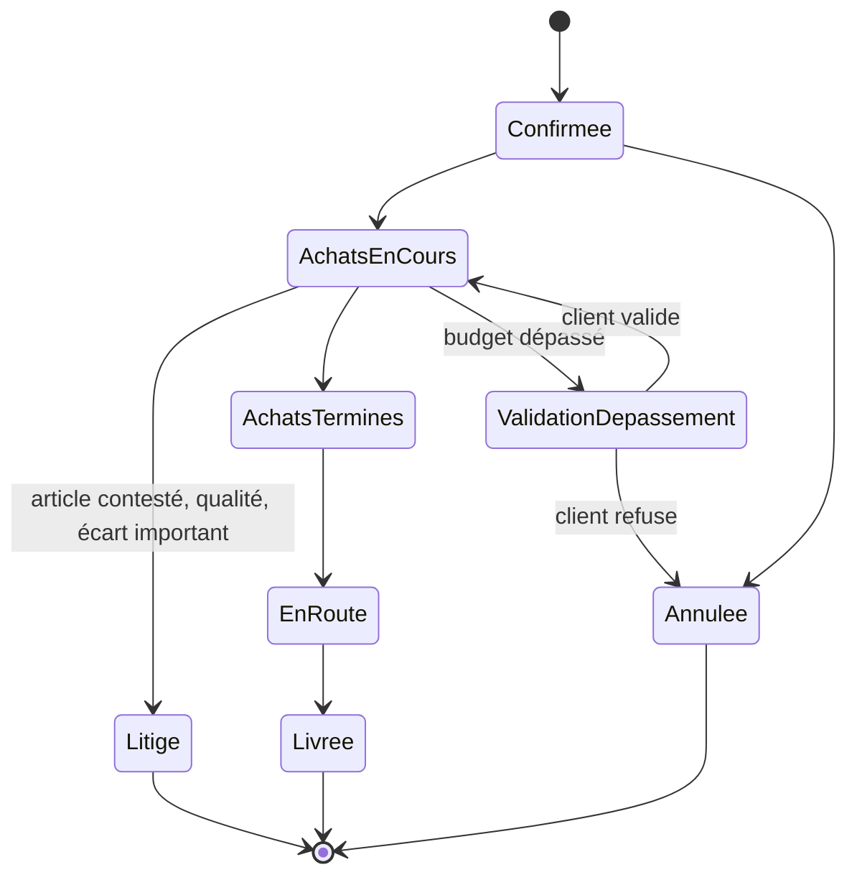

# Service Emplettes

Achats pour le compte du client : marché, supermarché, pharmacie ou commerce de
proximité, avec avance des fonds par ChapExpress ou paiement anticipé par le client.

Deux modes de commande, distincts dans leurs règles :
- **Mode (a) — Liste libre** : le client saisit une liste de courses en texte ou en
  photo, sans catalogue formel derrière (usage typique : le marché). Le montant réel
  n'est connu qu'après achat, d'où l'exigence d'un budget maximum.
- **Mode (b) — Catalogue partenaire** : le client sélectionne des articles dans le
  catalogue publié par un commerce partenaire (supermarché, pharmacie), avec prix
  affichés à la commande. Le montant est connu à l'avance ; pas de budget maximum au
  sens du mode (a).

## Parcours client pas à pas

## Machine à états

L'état `ValidationDepassement` ne concerne que le mode (a) liste libre : une commande
en mode (b) catalogue a un montant connu à l'avance et ne déclenche pas cette
transition.

## Règles métier

### Communes aux deux modes

- **Préférences de remplacement par article** définies par le client à la commande :
  « remplacer par équivalent », « m'appeler », « ne pas acheter » (voir
  [regles-gestion.md](regles-gestion.md) RG-06).
- **Pointage article par article** par le livreur pendant l'achat : acheté /
  indisponible / remplacé, avec saisie des prix réels et photos en cas de besoin.
- **Décompte final transparent** : montant des achats + frais de service + frais de
  livraison, ajusté au réel par rapport à l'estimation initiale.
- **Financement**, mécanismes possibles :
  1. Paiement anticipé par Mobile Money, régularisé (complément ou remboursement du
     trop-perçu) sur la base du montant réel constaté.
  2. Paiement de la totalité à la livraison en espèces, dans la limite de plafonds
     définis par l'administrateur.
  3. Avance des fonds par le livreur, dans la limite de son plafond d'avance,
     remboursée par le client à la livraison.

### Mode (a) — Liste libre

- **Budget maximum obligatoire**. Tout dépassement du budget nécessite une validation
  explicite du client avant poursuite des achats (voir
  [regles-gestion.md](regles-gestion.md) RG-05). Cette règle ne s'applique **qu'à ce
  mode** : le mode catalogue a un montant connu à l'avance.
- **Preuve d'achat** : récapitulatif des prix négociés (pas de ticket formel),
  notamment pour le marché, avec photos en cas de besoin (qualité des produits
  frais).
- **Vendeurs de marché non enregistrés comme partenaires** : le livreur agit en
  acheteur direct, sans interface commerce partenaire côté plateforme.

### Mode (b) — Catalogue partenaire

- **Montant connu à l'avance**, calculé automatiquement à partir des prix affichés au
  catalogue du commerce partenaire ; pas de règle de dépassement de budget.
- **Preuve d'achat** : photo du ticket de caisse remis par le commerce partenaire.
- **Indisponibilité d'un article catalogue** : signalée par le commerce partenaire
  (voir [acteurs.md](acteurs.md)), avec proposition de substitution possible avant ou
  pendant la préparation.
- **Cas de la pharmacie** : uniquement des produits sans ordonnance sont commandables
  directement au catalogue. Une photo d'ordonnance peut être jointe et transmise au
  pharmacien partenaire pour préparation, mais la délivrance reste sous la
  responsabilité de la pharmacie, pas de ChapExpress.

## Implémentation backend (2026-08-27, mode liste libre)

Voir [api-emplettes.md](api-emplettes.md) pour le contrat complet des
endpoints. Décisions prises pendant l'implémentation, faute d'arbitrage
explicite dans le cahier des charges :

- **Comportement par défaut sans préférence de remplacement (Q-11)** :
  `ne_pas_acheter`, conformément à la recommandation [DÉDUIT] de
  decisions-arbitrage.md — l'option la plus prudente financièrement.
- **Délai d'attente et escalade après dépassement de budget (Q-26)** :
  non implémentés. La commande reste bloquée en `validation_depassement`
  jusqu'à la réponse du client, sans limite de temps ni tâche planifiée —
  ce projet n'a pas d'infrastructure de job planifié. À revisiter si Q-26
  est tranché fermement.
- **Statut `litige`** : atteignable uniquement depuis `achats_en_cours`,
  strictement conforme à la machine à états ci-dessus (pas de raccourci
  depuis `validation_depassement`, `achats_termines` ou `en_route`).
- **Décompte final transparent** : `sousTotal`/`commission`/`montantTotal`
  sont une estimation à la création (sur la base de `budgetMax`), recalculés
  et figés au réel lors du passage en `achats_termines`. Aucune régularisation
  de paiement réelle (complément/trop-perçu) n'est implémentée — chantier
  séparé, lié à l'intégration d'un agrégateur (Q-07).

## Cas limites

- **Article indisponible sans préférence de remplacement définie pour cet article**
  (les deux modes) : comportement par défaut **[À ARBITRER]** — non précisé dans le
  cahier des charges.
- **Budget dépassé et client injoignable** (mode liste libre uniquement) : blocage
  par défaut des achats en attente de validation, décidé (voir
  [regles-gestion.md](regles-gestion.md) RG-05) — mais avec un délai d'attente
  maximum, au-delà duquel le cas est traité comme un incident (voir RG-12). Durée du
  délai et comportement précis après expiration : **[À ARBITRER]**, voir
  [decisions-ouvertes.md](decisions-ouvertes.md) Q-26.
- **Qualité contestée des produits frais** (marché) : documentée par photo à l'achat ;
  procédure de réclamation sous 24 h après livraison.
- **Écart de prix important** entre l'estimation et le réel : signalé par le livreur
  pendant l'achat, inclus dans le décompte final transparent.
- **Ordonnance nécessaire mais non fournie ou refusée par le pharmacien** : commande
  bloquée sur les produits concernés, la pharmacie reste seule juge de la délivrance.
- **Avance du livreur insuffisante** (budget dépassant son plafond personnel) :
  nécessite un paiement anticipé du client ou une réattribution à un autre livreur —
  **[À ARBITRER]**.

## Flux financier

1. Selon le mécanisme choisi à la commande : encaissement anticipé Mobile Money du
   budget, ou avance par le livreur dans la limite de son plafond, ou attente du
   paiement cash intégral à la livraison (selon plafonds fixés par l'administrateur).
2. Pendant l'achat, le livreur saisit les prix réels article par article ; le montant
   total des achats est ajusté au réel. En mode liste libre, l'écart se mesure par
   rapport au budget fixé par le client ; en mode catalogue, l'écart attendu est
   faible puisque le montant est connu à l'avance (variations possibles en cas
   d'indisponibilité/substitution d'article).
3. Frais de service (rémunération du service d'emplettes) et frais de livraison
   s'ajoutent au montant des achats dans le décompte final.
4. Commission : traitement différent selon le mode (voir
   [regles-gestion.md](regles-gestion.md) RG-08).
   - **Mode (b) catalogue** : une commission s'applique sur le montant des articles,
     et alimente le relevé de reversement du commerce partenaire.
   - **Mode (a) liste libre** : aucun partenaire enregistré dans la transaction (achat
     direct par le livreur, marché) — pas de commission sur les achats, seuls les
     frais de service rémunèrent ChapExpress.
5. Régularisation à la livraison : complément à payer par le client si le réel
   dépasse l'anticipé, ou remboursement du trop-perçu dans le cas inverse.
6. Le solde avancé ou encaissé par le livreur entre dans son rapprochement de caisse
   quotidien (voir [regles-gestion.md](regles-gestion.md) RG-03).

## Ce que voit le livreur

- Liste d'articles à acheter (mode libre ou catalogue), avec pour chacun la
  préférence de remplacement du client.
- Budget maximum affiché en mode liste libre uniquement ; montant total connu à
  l'avance en mode catalogue. Montant déjà avancé/encaissé visible dans les deux cas,
  dans la limite de son plafond personnel.
- Boutons de pointage par article : acheté / indisponible / remplacé, avec champ de
  saisie du prix réel et ajout de photo.
- Capture de la photo du ticket de caisse (ou saisie du récapitulatif marché) avant
  de clore les achats.
- Appel client intégré pour lever une ambiguïté (article « m'appeler »).
- Décompte final transmis au client avant la livraison.
