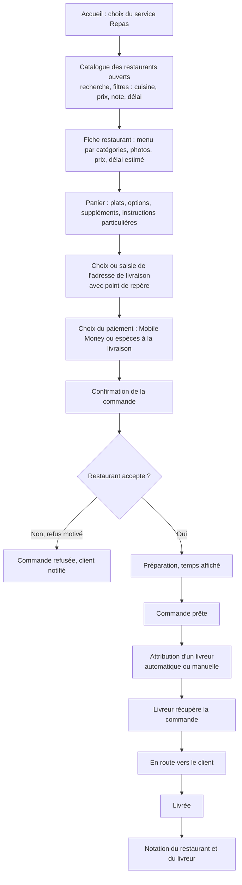
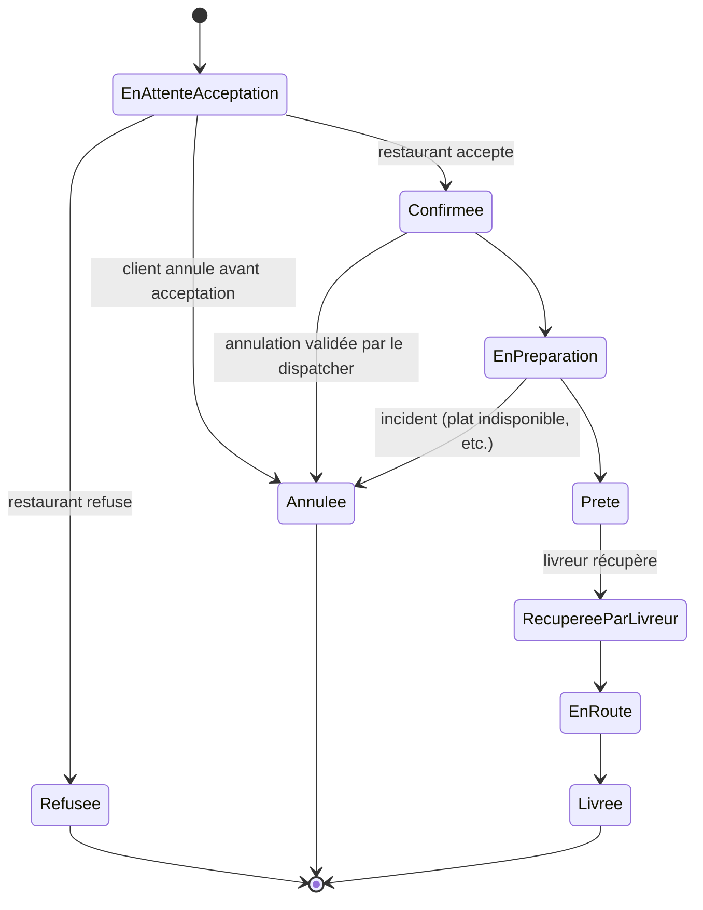

# Service Repas

Commande de repas auprès des restaurants partenaires, livraison à domicile ou au
bureau.

## Parcours client pas à pas

## Machine à états

## Règles métier

- Le restaurant doit accepter ou refuser une commande dans un délai imparti, avec
  motif en cas de refus. **[À ARBITRER]** : valeur exacte du délai.
- Un plat peut être désactivé en un clic (rupture de stock) ; il devient indisponible
  à la commande immédiatement.
- Le restaurant peut passer en statut « temporairement fermé », ce qui le retire du
  catalogue actif.
- L'attribution du livreur suit la règle générale d'attribution : voir
  [regles-gestion.md](regles-gestion.md) RG-14.
- Notification au restaurant par alerte sonore in-app ; secours par WhatsApp/SMS
  automatique pour les restaurants peu équipés.
- Commission calculée par restaurant selon un taux configurable par l'administrateur ;
  relevé de reversement hebdomadaire (ventes, commission, montant net).

## Cas limites

- **Plat devenu indisponible après confirmation** : le restaurant doit signaler
  l'indisponibilité ; traitement par annulation partielle ou substitution — modalité
  précise **[À ARBITRER]**, non détaillée dans le cahier des charges.
- **Restaurant ne répond pas dans le délai** : passage automatique en refus ou
  escalade au dispatcher — **[À ARBITRER]**.
- **Client injoignable à la livraison** : traité comme incident générique par le
  dispatcher (voir [regles-gestion.md](regles-gestion.md) RG-12).
- **Adresse imprécise** : le point de repère et la localisation carte sont
  obligatoires à la commande ; en dernier recours, appel du livreur au client.
- **Paiement espèces, appoint indisponible** : non traité explicitement dans le
  cahier des charges — **[À ARBITRER]**.
- **Annulation après acceptation par le restaurant** : nécessite validation du
  dispatcher (traité comme incident).

## Flux financier

**✅ Décidé (2026-08-25)** — voir détail et grille dans
[regles-gestion.md](regles-gestion.md) RG-08.

1. Le récapitulatif de commande affiche au client, de façon transparente, la
   décomposition du montant à payer :
   `Prix des plats + Frais de livraison (grille par zone) + Commission de 15 %
   (calculée sur prix des plats + frais de livraison)`.
2. Le client paie ce montant total à la commande (Mobile Money) ou à la livraison
   (espèces).
3. Le restaurant est reversé à hauteur du **prix plein de ses plats vendus** —
   aucune retenue de commission n'est appliquée sur sa vente. Périodicité du
   reversement : **[À ARBITRER]** (exemple cité ailleurs dans le cahier des
   charges : hebdomadaire).
4. ChapExpress conserve les frais de livraison et la commission de 15 % : c'est le
   revenu de la plateforme sur ce service.
5. **[À ARBITRER]** : modèle de rémunération du livreur pour une course Repas
   (montant fixe par course, pourcentage, autre) — non spécifié dans le cahier des
   charges, et **non financé par les frais de livraison**, qui reviennent à
   ChapExpress (voir [decisions-ouvertes.md](decisions-ouvertes.md) Q-08). Le
   livreur encaisse néanmoins les espèces le cas échéant (montant total, frais et
   commission inclus), à reverser dans son rapprochement de caisse.

## Ce que voit le livreur

- Détail de la course : type de service (Repas), point de récupération (restaurant),
  point de livraison (client), point de repère, montant à encaisser si paiement
  espèces.
- Bouton d'acceptation de la course.
- Mise à jour de statut : récupérée → en route → livrée.
- Itinéraire vers le restaurant puis vers le client (ouverture dans Google Maps).
- Aucune preuve de livraison formalisée n'est spécifiée pour Repas (contrairement au
  Colis) — **[DÉDUIT]** : probablement acceptable vu la nature du produit, à confirmer.
